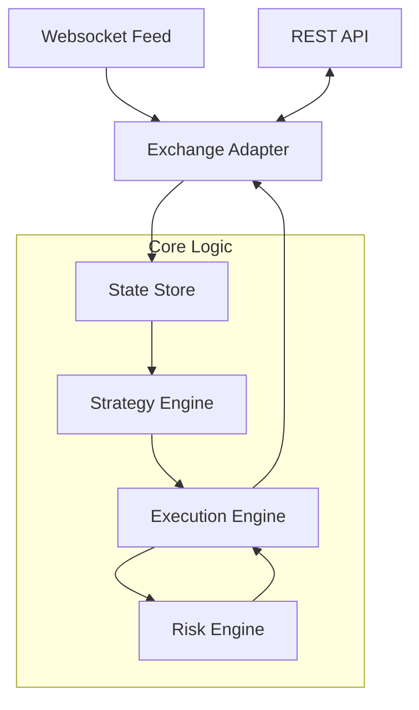

# ⚡ Turbine Trading Agent
### *Autonomous Market-Making for Prediction Markets*

Welcome to the **Turbine Trading Agent**, a high-performance, autonomous trading system engineered for prediction market Central Limit Order Books (CLOBs). Designed with a "Safety-First" philosophy, this agent provides liquidity while managing inventory risk through sophisticated skewing and imbalance detection.

---

## 🌟 Features at a Glance

*   **🛡️ Robust Risk Management**: Real-time monitoring of inventory caps, portfolio exposure, and drawdowns.
*   **📈 Dynamic Strategy Engine**: Sophisticated market-making logic with automatic inventory skewing and orderbook imbalance overlays.
*   **⚡ Async Performance**: Built on Python's `asyncio` for low-latency event processing and order execution.
*   **🧪 Risk-Free Simulation**: A built-in exchange simulator allows for extensive strategy backtesting and verification without risking real capital.
*   **🔌 Plug-and-Play Architecture**: Clean separation between core logic and exchange-specific adapters.

---


## Strategy Doctrine

This bot implements **inventory-aware market making** with automatic rollover between BTC quick markets:

### Core Principles

1. **Inventory Skew**: Quotes automatically shift based on position to naturally rebalance
   - Long position → Lower quotes to encourage selling
   - Short position → Higher quotes to encourage buying
   - Prevents inventory buildup in a single direction

2. **Extremes Risk Control**: When market price approaches 0% or 100%:
   - Spreads widen by 2x to account for increased risk
   - Order sizes reduce to 50% to limit exposure
   - Conservative approach to tail risk

3. **Auto-Rollover**: Seamlessly transitions between BTC 15-minute markets
   - Polls `get_quick_market("BTC")` every 10 seconds
   - Detects market changes automatically
   - Cancels old orders and subscribes to new market
   - Zero downtime between market expiries

4. **Orderbook-Driven Pricing**: No external oracles or price feeds
   - Fair price = orderbook mid (best bid/ask average)
   - Spreads and skews applied relative to mid
   - Pure market-making approach without directional bets

### What's NOT Implemented

- ❌ Directional betting strategies
- ❌ Price action following / momentum trading
- ❌ External oracle signals (Pyth, Chainlink, etc.)
- ❌ Mean reversion as a standalone thesis

This is a **market-neutral, inventory-aware liquidity provision strategy** optimized for uptime and realized PnL.

---

## 🏗️ Architecture Overview

The system is designed as a series of decoupled engines, each responsible for a specific domain of the trading lifecycle:



### Component Breakdown
- **[State Store](file:///home/aaron/code/turbine_agent/src/core/state.py)**: The central source of truth, maintaining a real-time snapshot of orderbooks, open orders, and current positions.
- **[Strategy Engine](file:///home/aaron/code/turbine_agent/src/strategy/engine.py)**: The "brain" that calculates optimal bid/ask prices based on fair value, current inventory, and market pressure.
- **[Risk Engine](file:///home/aaron/code/turbine_agent/src/risk/engine.py)**: The final gatekeeper that validates every order against hard safety limits before it reaches the exchange.
- **[Execution Engine](file:///home/aaron/code/turbine_agent/src/execution/engine.py)**: Handles the "diffing" logic to reconcile desired quotes with existing orders on the book.

---

## 🎯 Strategy Deep Dive

### 1. Market Making (The Base Layer)
The agent continuously quotes buy and sell orders around a "Fair Value" (typically the mid-price). This provides liquidity and earns the bid-ask spread.

### 2. Inventory Skewing (Risk Mitigation)
To avoid getting "stuck" with a large position, the agent skews its prices:
- **If Long**: Lowers both bid and ask to encourage selling and discourage further buying.
- **If Short**: Raises both bid and ask to encourage buying and discourage further selling.

### 3. Imbalance Overlay (Momentum Sensing)
The agent monitors the relative depth of the top 5 levels of the orderbook.
- **High Bid Depth**: If there is more buy-side interest, the agent biases its quotes upward to anticipate price appreciation.
- **High Ask Depth**: If sell-side interest dominates, it biases downward.

---

## 🛡️ Safety & Reliability

> [!IMPORTANT]
> This agent is built to **Fail Closed**. If any component (Websocket, API, Logic) reports an inconsistent state, the agent will immediately cancel all orders and pause trading until a full resync is completed.

- **Sequence Gap Detection**: Automatically detects missing market data packets.
- **Volatility Guard**: Pauses trading if the mid-price moves too rapidly within a 60-second window.
- **Connectivity Heartbeats**: Monitors exchange health; 5 seconds of silence triggers an automatic safety shutdown.

---

## 🛠️ Getting Started

### Quick Setup
1.  **Activate Environment**:
    ```bash
    source .venv/bin/activate
    ```
2.  **Install Agent & Client**:
    ```bash
    # Install internal requirements
    pip install -r requirements.txt
    # Install the Turbine Python Client (local editable mode)
    pip install -e ./turbine-py-client
    # Install runtime helpers
    pip install python-dotenv httpx
    ```
3.  **Verify Setup with Read-Only Probe**:
    ```bash
    python -m src.tools.connectivity_probe
    ```
    Expected: BTC market details, orderbook snapshot, total markets count.

4.  **Run Simulation (No Trading)**:
    ```bash
    python src/main.py --simulated
    ```

### Enable Live Trading

> [!WARNING]
> Live trading requires authentication and will execute real orders on Polygon Mainnet.

1. **Configure Credentials**: Copy `env.example` to `.env` and add:
   ```bash
   TURBINE_PRIVATE_KEY=0x...
   TURBINE_API_KEY_ID=...
   TURBINE_API_PRIVATE_KEY=...
   ```

2. **Run Live Bot**:
   ```bash
   python src/main.py
   ```

### Configuration
Edit [`config.yaml`](file:///home/aaron/code/turbine_agent/config.yaml) to tune your strategy parameters, risk limits, and market selection.

---

## 📂 Project Navigation

- [`src/main.py`](file:///home/aaron/code/turbine_agent/src/main.py): Application entry point.
- [`src/tools/connectivity_probe.py`](file:///home/aaron/code/turbine_agent/src/tools/connectivity_probe.py): Read-only API connectivity test.
- [`RUNBOOK.md`](file:///home/aaron/code/turbine_agent/RUNBOOK.md): Detailed operational and deployment guide.
- [`history.md`](file:///home/aaron/code/turbine_agent/history.md): Technical change log and current project status.
- [`next.md`](file:///home/aaron/code/turbine_agent/next.md): Upcoming roadmap and development phases.

---
*Developed for the next generation of prediction market traders.*
# turbine_agent
